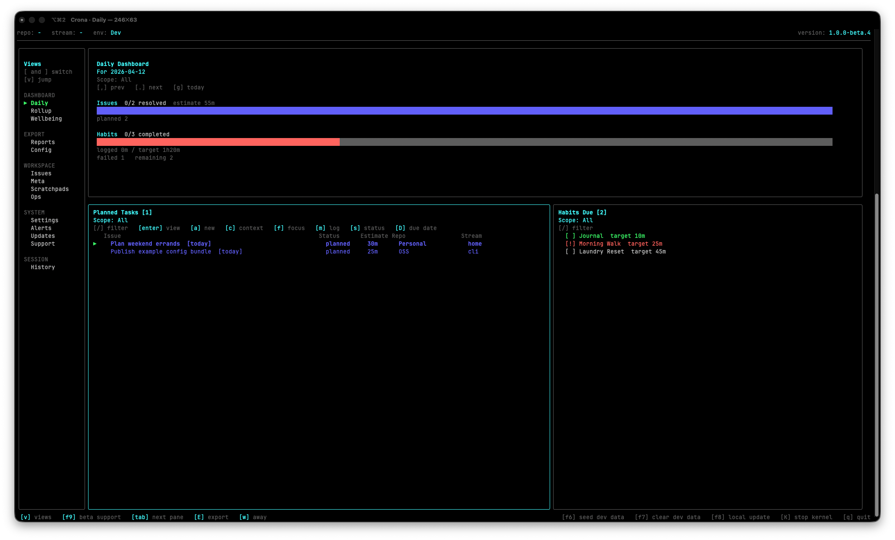
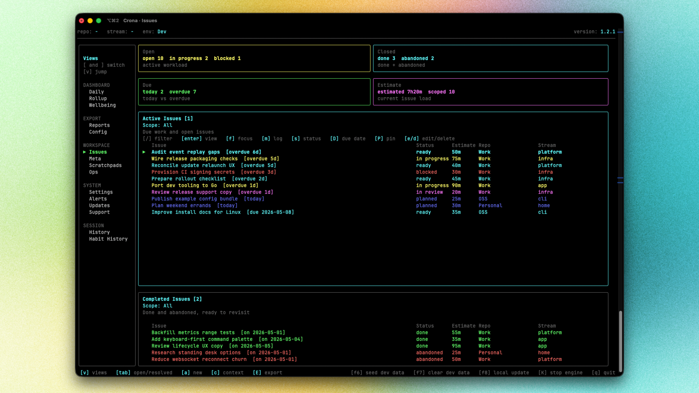
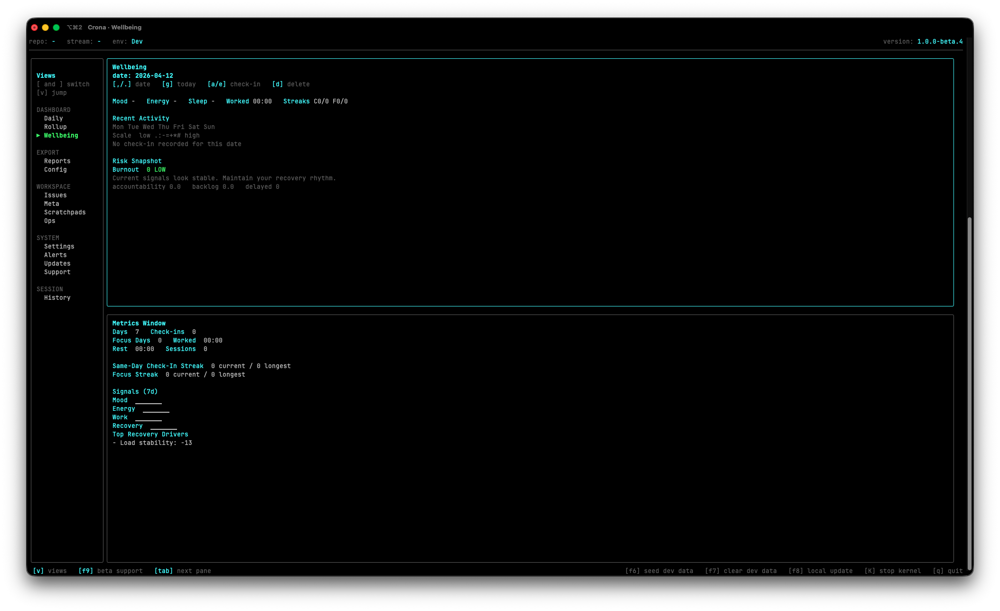

# Crona

<p align="center">
  
</p>

Crona is a local-first work tracker for developers. It combines a terminal UI, a scriptable CLI, and a background local engine into one workflow for planning work, tracking focus sessions, and exporting structured artifacts.

The repository is a Go monorepo with four main modules:
- `kernel`: background local engine, SQLite store, timer, IPC, update checks
- `tui`: Bubble Tea terminal UI
- `cli`: scriptable commands and local engine control flows
- `shared`: shared types, config, protocol, and utilities

## Screenshots







## Quick Start

See the full installation guide in [docs/install.md](docs/install.md).

Runtime notes:
- local alerts are emitted by the background engine, not the TUI process
- scheduled reminders only fire while the background engine is running
- the TUI owns the terminal tab title while it is running and shows active session context when focused
- PDF export depends on local renderer tooling; see [docs/install.md](docs/install.md)

Launch the TUI:

```bash
crona
```

Inspect the local engine from the CLI:

```bash
crona kernel attach --json
crona kernel status --json
crona kernel info --json
```

The command group is named `kernel` because it controls the internal engine process. User-facing docs generally call it the local engine or background engine.

Generate shell completions:

```bash
crona completion zsh
crona completion bash
crona completion fish
```


## Documentation

- [Docs Index](docs/README.md)
- [Concepts](docs/concepts.md)
- [Install](docs/install.md)
- [Development](docs/development.md)
- [Contributing](docs/contributing.md)
- [Release Process](docs/release.md)
- [Socket API](docs/api/socket.md)
- [Changelog](docs/changelog.md)
- [Feature Design](docs/feature-design.md)

Operational references:
- [Notification and alert behavior](docs/install.md#notifications-and-alerts)
- [PDF rendering support](docs/install.md#pdf-rendering)

## Support And Updates

Public support surfaces live on GitHub:

- Bugs: [Issues](https://github.com/webxsid/crona/issues)
- Help and ideas: [Discussions](https://github.com/webxsid/crona/discussions)
- Release updates: [Releases](https://github.com/webxsid/crona/releases)
- Release process: [docs/release.md](docs/release.md)

Generate a support bundle from the TUI Support view before filing a bug when possible.

## License

[MIT](LICENSE)
