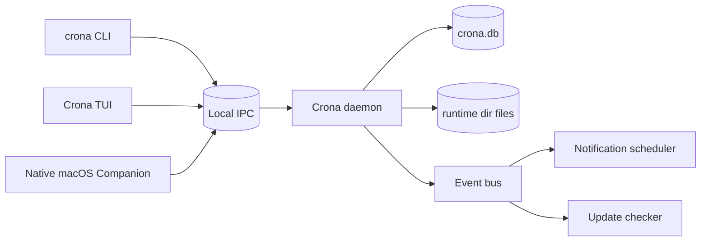
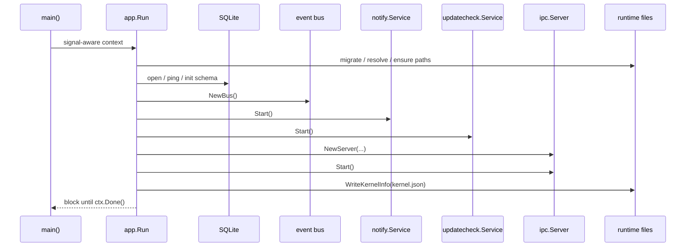
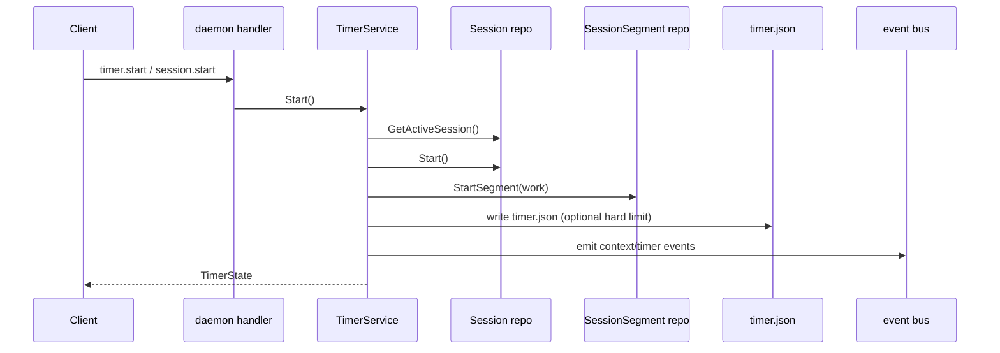

# Crona Desktop Companion Architecture Audit

## Executive Summary

Crona is already structured as a local-first daemon plus client frontends. The daemon is the source of truth for work state, timer state, reminders, updates, exports, and the local IPC contract. The TUI and CLI are thin clients over that daemon. A native macOS Companion should follow the same model: discover the daemon from runtime metadata, connect over the existing local IPC transport, project state locally, and never depend on `tui/internal/*`.

The current architecture is strong enough for a companion build, but there are a few important boundaries to respect:

- IPC is local-only JSON over Unix sockets or Windows named pipes, not REST/SSE/websocket.
- The daemon publishes events, but event payloads are invalidation hints, not a durable UI state model.
- There is a compatibility split between legacy `session.*` methods and the preferred `timer.*` methods.
- `events.subscribe` currently streams events directly; there is no explicit subscription ack frame.
- `timer.tick` is defined in shared types but is not emitted anywhere. `ops.created` is handled by the TUI but is not published by the daemon.

The companion should build on the shared contract layer, replicate the current daemon discovery flow, and treat daemon state as authoritative.

## Repository Overview

| Module | Ownership | Responsibility |
| --- | --- | --- |
| `kernel` | Daemon | Background process, SQLite store, IPC server, timers, notifications, updates, exports, runtime files |
| `tui` | Terminal UI | Bubble Tea app, views, dialogs, event subscription, local projection state |
| `cli` | Command line | Scriptable commands, daemon discovery/launch, IPC client, installation/update helpers |
| `shared` | Shared contract layer | Protocol, DTOs, domain types, config, IPC helpers, utilities, versions |
| `assets` | Embedded assets | Bundled templates, export assets, alert sounds |

The root `go.work` includes all five modules. The root `Makefile` builds and tests each module separately and treats `kernel` as the daemon binary package and `tui` as a distinct frontend binary.

## Architecture Overview



The daemon owns the canonical state machine. Clients should:

1. discover the daemon from runtime metadata,
2. probe health with `health.get`,
3. fetch a baseline snapshot with `kernel.info.get` and the relevant projection APIs,
4. subscribe to events,
5. refetch projections when events invalidate local state.

## Daemon Architecture

### Startup Sequence

`kernel/cmd/crona-kernel/main.go` only wires OS signals to `app.Run(ctx)`.

`kernel/internal/app/app.go` performs startup in this order:

1. load environment and mode via `shared/config.Load()`,
2. migrate legacy runtime directories if needed,
3. resolve runtime paths,
4. create required directories,
5. ensure bundled assets exist,
6. create the logger,
7. open SQLite with WAL and a single shared connection,
8. initialize the schema idempotently,
9. create the event bus,
10. build the core context and initialize defaults,
11. seed custom momentum snapshot state,
12. initialize telemetry,
13. start notification and update services,
14. ensure export assets are present,
15. build and write `KernelInfo`,
16. create the IPC server,
17. recover timer boundary/runtime state,
18. start the IPC listener,
19. write `kernel.json`,
20. wait for shutdown context cancellation.



### Shutdown Sequence

Shutdown is context-driven:

1. the root signal context is canceled,
2. notification and update goroutines stop on `ctx.Done()`,
3. the IPC server is closed,
4. `kernel.json` is cleared,
5. the SQLite store is closed.

There is no separate shutdown RPC beyond `kernel.shutdown` and `kernel.restart`, both of which currently call the same shutdown callback.

### Dependency Graph

`core.Context` wires together the store registry, health service, user/device identity, clock, scratch dir, and event bus.

Services depend on it as follows:

- core commands depend on `core.Context`,
- notifications depend on core settings, alert reminders, sessions, active context, and the bus,
- update checks depend on core settings, install metadata, and the bus,
- the IPC handler depends on core commands, notify service, update service, logger, runtime paths, and telemetry,
- the timer service is a singleton per core context.

### Runtime Initialization

Runtime state is file-backed in the runtime directory:

- `kernel.json` stores daemon discovery and runtime metadata,
- `timer.json` stores timer boundary / hard-limit state,
- `install.json` stores install source and release channel metadata,
- `tui.json` stores TUI runtime metadata,
- `logs/<date>/info.log` and `logs/<date>/error.log` store process logs.

The runtime dir is resolved from `CRONA_HOME` or OS defaults and is migrated from legacy `~/.crona` / `~/.crona-dev` on Unix-like systems unless an override is set.

### Database Initialization

SQLite is opened with:

- WAL journal mode,
- a 5 second busy timeout,
- a single shared open connection,
- Bun as the ORM layer.

Schema initialization is idempotent. It creates tables, ensures missing columns, backfills new columns, and adds indexes in-process on startup. There is no numbered migration framework; the schema initializer is the migration system.

### Service Lifecycle

#### Event Bus

`kernel/internal/events/bus.go` implements a synchronous listener list behind an RWMutex. Emit is inline and subscription returns an unsubscribe closure. A slow subscriber can block the publisher. The IPC event stream listener uses a bounded channel and drops events if the channel is full.

#### Timer Lifecycle

`corecommands.GetTimerService()` returns a singleton timer service for the current core context. The service holds a single `time.Timer` for the next boundary and is responsible for:

- starting sessions,
- pausing/resuming structured segments,
- advancing prepared or active segments,
- handling hard-limit extensions and expiry,
- recovering boundaries after startup,
- scheduling the next boundary,
- emitting `timer.state`, `timer.boundary`, and `timer.hard_limit_reached`.

#### Update Lifecycle

`updatecheck.Start()`:

- loads the current update status,
- performs an initial refresh with a 15 second timeout,
- refreshes every 24 hours,
- emits `update.status` only when the status actually changes.

#### Notification Lifecycle

`notify.Start()`:

- subscribes to the event bus,
- queues alert requests from timer boundary, hard-limit, and update events,
- starts a 30 second reminder scheduler,
- starts a 30 second inactivity scheduler,
- delivers notifications through OS-specific helpers.

## IPC Architecture

### Transport

Actual transport:

- Unix-domain sockets on Unix-like platforms,
- named pipes on Windows.

Not used:

- REST,
- SSE,
- websocket.

The transport is local-only and is selected by `shared/localipc.DefaultTransport()`.

### Endpoint Selection

- Unix-like default endpoint: `<runtime base>/kernel.sock`
- Windows default endpoint: `\\.\pipe\crona-daemon` with a runtime-base hash suffix
- Dev mode appends `-dev` to the pipe name

The pipe suffix is derived from a SHA-1 hash of the runtime base path to avoid collisions between different install/runtime roots.

### Request / Response Framing

The wire protocol is newline-delimited JSON envelopes:

```json
{"id":"req-1","method":"repo.list","params":{}}
```

```json
{"id":"req-1","result":{}}
```

```json
{"id":"req-1","error":{"code":"request_failed","message":"..."}}
```

The server reads with `bufio.Scanner`, so payloads are subject to Scanner's default token limit unless the implementation is changed. Clients currently send one request per connection and read one response per request.

### Streaming Events

`events.subscribe` upgrades the connection into a long-lived event stream. The daemon does not send a formal subscription ack; the stream simply begins forwarding `protocol.Event` frames.

The TUI reconnect loop re-establishes the subscription after a disconnect with a 2 second backoff. RPC calls do not reuse connections; they open a new connection for each call.

### Timeouts

- TUI RPC dial timeout: 10s
- CLI RPC dial timeout: 5s
- health probe timeout: 2s
- event reconnect backoff: 2s
- request deadline in clients: 10s

### Error Handling

Observed error behavior:

- malformed requests can return `invalid_request`,
- unsupported stream methods return `not_implemented`,
- unknown methods return `not_implemented`,
- domain validation failures are returned as `request_failed` or a domain-specific code if the error exposes `ProtocolErrorCode()`,
- structured error payloads are returned via `protocol.Error.Data` when available.

## API Inventory

### Kernel / Health / Update / Alerts

| Method | Purpose | Input | Output | Side effects | Current consumers | Companion? |
| --- | --- | --- | --- | --- | --- | --- |
| `events.subscribe` | Open event stream | `dto.Empty` | event frames | Registers bus listener | TUI | Yes |
| `health.get` | Health snapshot | `dto.Empty` | `types.Health` | DB ping with 2s timeout | TUI, CLI | Yes |
| `kernel.info.get` | Runtime metadata | `dto.Empty` | `types.KernelInfo` | None | TUI, CLI, startup discovery | Yes |
| `kernel.shutdown` | Graceful shutdown | `dto.Empty` | `dto.OKResponse` | Cancels root context | CLI detach | No, internal control |
| `kernel.restart` | Restart request | `dto.Empty` | `dto.OKResponse` | Same shutdown callback as above | CLI restart | No, internal control |
| `kernel.dev.seed` | Seed dev data | `dto.Empty` | `dto.OKResponse` | Rebuilds dev fixtures | CLI dev, TUI hotkey | No |
| `kernel.dev.clear` | Clear dev data | `dto.Empty` | `dto.OKResponse` | Clears DB and resets runtime files | CLI dev, TUI hotkey | No |
| `kernel.data.wipe` | Dangerous data wipe | `dto.ConfirmDangerousActionRequest` | `dto.OKResponse` | Clears DB and runtime-managed data | CLI wipe-data | No |
| `update.status.get` | Update status snapshot | `dto.Empty` | `types.UpdateStatus` | May trigger local release metadata reads | TUI, CLI | Yes |
| `update.check` | Force update refresh | `dto.Empty` | `types.UpdateStatus` | Network fetch, status emit | TUI, CLI | Yes |
| `alerts.status.get` | Alert backend capability snapshot | `dto.Empty` | `types.AlertStatus` | Detects OS helpers | TUI | Yes |
| `alerts.test_notification` | Test notification delivery | `dto.Empty` | `dto.OKResponse` | Enqueues test alert | TUI | Yes |
| `alerts.test_sound` | Test alert sound | `dto.Empty` | `dto.OKResponse` | Enqueues test sound | TUI | Yes |
| `alerts.notify` | Deliver one alert | `types.AlertRequest` | `dto.OKResponse` | Enqueues/plays/sends alert | daemon internal timer/update/reminder flows | Mostly internal |
| `alerts.reminders.list` | List reminders | `dto.Empty` | `[]types.AlertReminder` | None | TUI | Yes |
| `alerts.reminders.create` | Create reminder | `dto.AlertReminderCreateRequest` | `types.AlertReminder` | Persists reminder | TUI | Yes |
| `alerts.reminders.update` | Update reminder | `dto.AlertReminderUpdateRequest` | `types.AlertReminder` | Persists reminder | TUI | Yes |
| `alerts.reminders.delete` | Delete reminder | `dto.AlertReminderIDRequest` | `dto.OKResponse` | Deletes reminder | TUI | Yes |
| `alerts.reminders.toggle` | Toggle reminder | `dto.AlertReminderToggleRequest` | `types.AlertReminder` | Persists enabled state | TUI | Yes |

### Repos / Streams / Issues / Habits / Momentum

| Method | Purpose | Input | Output | Side effects | Current consumers | Companion? |
| --- | --- | --- | --- | --- | --- | --- |
| `repo.list` | List repos | `dto.Empty` | `[]types.Repo` | None | TUI, CLI | Yes |
| `repo.create` | Create repo | `dto.CreateRepoRequest` | `types.Repo` | Writes repo + op + event | TUI, dev seed | Yes |
| `repo.update` | Update repo | `dto.UpdateRepoRequest` | `types.Repo` | Writes repo + op + event | TUI, CLI | Yes |
| `repo.delete` | Delete repo | `dto.NumericIDRequest` | `dto.OKResponse` | Cascades soft delete + op + event | TUI, CLI | Yes |
| `stream.list` | List streams in repo | `dto.ListStreamsQuery` | `[]types.Stream` | None | TUI, CLI | Yes |
| `stream.create` | Create stream | `dto.CreateStreamRequest` | `types.Stream` | Writes stream + op + event | TUI, dev seed | Yes |
| `stream.update` | Update stream | `dto.UpdateStreamRequest` | `types.Stream` | Writes stream + op + event | TUI, CLI | Yes |
| `stream.delete` | Delete stream | `dto.NumericIDRequest` | `dto.OKResponse` | Cascades soft delete + op + event | TUI, CLI | Yes |
| `issue.list` | List issues in stream | `dto.ListIssuesQuery` | `[]types.Issue` | None | TUI, CLI | Yes |
| `issue.list_all` | List all issues | `dto.Empty` | `[]types.IssueWithMeta` | None | TUI, CLI | Yes |
| `issue.create` | Create issue | `dto.CreateIssueRequest` | `types.Issue` | Writes issue + op + event | TUI, dev seed | Yes |
| `issue.update` | Patch issue | `dto.UpdateIssueRequest` | `types.Issue` | Writes issue + op + event | TUI, CLI | Yes |
| `issue.delete` | Delete issue | `dto.NumericIDRequest` | `dto.OKResponse` | Soft delete + op + event | TUI, CLI | Yes |
| `issue.change_status` | Transition issue state | `dto.ChangeIssueStatusRequest` | `types.Issue` | Writes issue + op + event | TUI, CLI | Yes |
| `issue.set_todo` | Assign todo date | `dto.SetIssueTodoRequest` | `types.Issue` | Writes issue + op + event | TUI, CLI | Yes |
| `issue.clear_todo` | Clear todo date | `dto.SetIssueTodoRequest` | `types.Issue` | Writes issue + op + event | TUI, CLI | Yes |
| `issue.daily_summary` | Day summary for any date | `dto.DailyIssueSummaryQuery` | `types.DailyIssueSummary` | None | TUI, CLI | Yes |
| `issue.today_summary` | Summary shortcut | `dto.Empty` | `types.DailyIssueSummary` | None | TUI, CLI | Yes |
| `daily_plan.get` | Planned work for a date | `dto.DailyPlanQuery` | `types.DailyPlan` | None | TUI, CLI | Yes |
| `habit.list` | List habits in stream | `dto.ListHabitsQuery` | `[]types.Habit` | None | TUI, CLI | Yes |
| `habit.list_all` | List all habits with meta | `dto.Empty` | `[]types.HabitWithMeta` | None | TUI, CLI | Yes |
| `habit.list_due` | List due habits for a date | `dto.ListHabitsDueQuery` | `[]types.HabitDailyItem` | None | TUI, CLI | Yes |
| `habit.create` | Create habit | `dto.CreateHabitRequest` | `types.Habit` | Writes habit + op + event | TUI, dev seed | Yes |
| `habit.update` | Update habit | `dto.UpdateHabitRequest` | `types.Habit` | Writes habit + op + event | TUI, CLI | Yes |
| `habit.delete` | Delete habit | `dto.NumericIDRequest` | `dto.OKResponse` | Soft delete + op + event | TUI, CLI | Yes |
| `habit.complete` | Complete habit | `dto.HabitCompletionUpsertRequest` | `types.HabitCompletion` | Writes completion + op + event | TUI, CLI | Yes |
| `habit.uncomplete` | Remove completion | `dto.HabitCompletionUpsertRequest` | `dto.OKResponse` | Deletes completion + op + event | TUI, CLI | Yes |
| `habit.history` | Habit completion history | `dto.HabitHistoryQuery` | `[]types.HabitCompletion` | None | TUI, CLI | Yes |
| `momentum.list` | List momentum definitions | `dto.Empty` | `[]types.HabitStreakDefinition` | None | TUI, CLI | Yes |
| `momentum.create` | Create momentum definition | `dto.HabitStreakDefinitionRequest` | `types.HabitStreakDefinition` | Writes definition | TUI, CLI | Yes |
| `momentum.update` | Update momentum definition | `dto.HabitStreakDefinitionRequest` | `types.HabitStreakDefinition` | Writes definition | TUI, CLI | Yes |
| `momentum.delete` | Delete momentum definition | `dto.HabitStreakDefinitionDeleteRequest` | `dto.OKResponse` | Soft delete | TUI, CLI | Yes |
| `momentum.range` | Momentum cards for window | `dto.MomentumRangeRequest` | `[]types.MomentumCard` | None | TUI, CLI | Yes |
| `momentum.detail` | Momentum detail overlay | `dto.MomentumDetailRequest` | `types.MomentumDetail` | None | TUI, CLI | Yes |

### Check-Ins / Metrics / Dashboard / Export

| Method | Purpose | Input | Output | Side effects | Current consumers | Companion? |
| --- | --- | --- | --- | --- | --- | --- |
| `checkin.get` | Read one check-in | `dto.DailyCheckInQuery` | `types.DailyCheckIn` | None | TUI, CLI | Yes |
| `checkin.upsert` | Write one check-in | `dto.DailyCheckInUpsertRequest` | `types.DailyCheckIn` | Writes check-in + op + event | TUI, CLI | Yes |
| `checkin.delete` | Delete one check-in | `dto.DeleteByDateRequest` | `dto.OKResponse` | Deletes check-in + op + event | TUI, CLI | Yes |
| `checkin.range` | Range query | `dto.DateRangeQuery` | `[]types.DailyCheckIn` | None | TUI, CLI | Yes |
| `metrics.range` | Per-day metrics | `dto.DateRangeQuery` | `[]types.DailyMetricsDay` | None | TUI, CLI | Yes |
| `metrics.rollup` | Aggregate metrics | `dto.DateRangeQuery` | `types.MetricsRollup` | None | TUI, CLI | Yes |
| `metrics.streaks` | Range-based streaks | `dto.DateRangeQuery` | `types.StreakSummary` | None | TUI, CLI | Yes |
| `metrics.streaks_lifetime` | Lifetime streaks through date | `dto.DailyCheckInQuery` | `types.StreakSummary` | None | TUI | Yes |
| `dashboard.window` | Daily plan window summary | `dto.DashboardWindowQuery` | `types.DashboardWindowSummary` | None | TUI | Yes |
| `dashboard.focus_score` | Focus score summary; target comes from estimates on issues due in the requested range | `dto.DashboardSummaryQuery` | `types.FocusScoreSummary` | None | TUI, companion | Yes |
| `dashboard.focus_score_range` | One focus-score result per date in an inclusive range | `dto.DateRangeQuery` | `types.FocusScoreRangeDay[]` | None | TUI | Yes |
| `dashboard.distribution` | Time distribution summary | `dto.DashboardSummaryQuery` | `types.TimeDistributionSummary` | None | TUI | Yes |
| `dashboard.goal_progress` | Goal progress summary | `dto.DashboardSummaryQuery` | `types.GoalProgressSummary` | None | TUI | Yes |
| `export.glance` | Summary export | `dto.ExportReportRequest` | `types.ExportReportResult` | Writes artifact or clipboard | TUI, CLI | Yes |
| `export.daily` | Daily export | `dto.DailyReportRequest` | `types.ExportReportResult` | Writes report artifact or clipboard | TUI, CLI | Yes |
| `export.weekly` | Weekly export | `dto.ExportReportRequest` | `types.ExportReportResult` | Writes report artifact or clipboard | TUI, CLI | Yes |
| `export.repo` | Repo export | `dto.ExportReportRequest` | `types.ExportReportResult` | Writes artifact or clipboard | TUI, CLI | Yes |
| `export.stream` | Stream export | `dto.ExportReportRequest` | `types.ExportReportResult` | Writes artifact or clipboard | TUI, CLI | Yes |
| `export.issue_rollup` | Issue rollup export | `dto.ExportReportRequest` | `types.ExportReportResult` | Writes artifact or clipboard | TUI, CLI | Yes |
| `export.csv` | CSV export | `dto.ExportReportRequest` | `types.ExportReportResult` | Writes artifact or clipboard | TUI, CLI | Yes |
| `export.calendar` | Deterministic ICS export | `dto.ExportCalendarRequest` | `types.CalendarExportResult` | Writes `.ics` files | TUI, CLI | Yes |
| `export.assets.get` | Export asset/runtime capability snapshot | `dto.Empty` | `types.ExportAssetStatus` | Ensures assets | TUI, CLI | Yes |
| `export.reports_dir.set` | Set reports dir | `dto.ExportReportsDirUpdateRequest` | `types.ExportAssetStatus` | Persists runtime export dir | TUI | Yes |
| `export.ics_dir.set` | Set ICS dir | `dto.ExportICSDirUpdateRequest` | `types.ExportAssetStatus` | Persists runtime export dir | TUI | Yes |
| `export.reports.list` | List generated reports | `dto.Empty` | `[]types.ExportReportFile` | None | TUI, CLI | Yes |
| `export.reports.delete` | Delete generated report | `dto.ExportReportDeleteRequest` | `dto.OKResponse` | Deletes artifact file | TUI, CLI | Yes |
| `export.template.reset` | Reset template/preset to bundled defaults | `dto.ExportTemplateResetRequest` | `types.ExportAssetStatus` | Rewrites template files | TUI | Yes |
| `export.template.apply` | Apply preset template | `dto.ExportTemplatePresetApplyRequest` | `types.ExportAssetStatus` | Rewrites template files | TUI | Yes |

### Sessions / Timer / Context / Settings / Ops

| Method | Purpose | Input | Output | Side effects | Current consumers | Companion? |
| --- | --- | --- | --- | --- | --- | --- |
| `session.list_by_issue` | Sessions for issue | `dto.ListSessionsQuery` | `[]types.Session` | None | TUI | Yes |
| `session.get` | Session by ID | `dto.SessionIDRequest` | `types.Session` | None | TUI | Yes |
| `session.detail` | Full session detail | `dto.SessionIDRequest` | `types.SessionDetail` | None | TUI | Yes |
| `session.get_active` | Active session snapshot | `dto.Empty` | `types.Session` or `null` | None | TUI | Yes |
| `session.start` | Start a session | `dto.StartSessionRequest` | `types.Session` | Writes session + segment + op + event | compatibility / daemon internal | Prefer `timer.start` |
| `session.pause` | Pause active session | `dto.Empty` | `types.TimerState` | Starts next segment | compatibility / daemon internal | Prefer `timer.pause` |
| `session.resume` | Resume active session | `dto.Empty` | `types.TimerState` | Starts work segment | compatibility / daemon internal | Prefer `timer.resume` |
| `session.end` | End active session | `dto.EndSessionRequest` | `types.Session` | Stops session + emits event | compatibility / daemon internal | Prefer `timer.end` |
| `session.log_manual` | Create manual session | `dto.ManualSessionLogRequest` | `types.Session` | Writes completed session + segments + op + event | TUI | Yes |
| `session.amend_note` | Amend session note | `dto.AmendSessionNoteRequest` | `types.Session` | Rewrites session note + op | TUI | Yes |
| `session.history` | Session history | `dto.SessionHistoryQuery` | `[]types.SessionHistoryEntry` | None | TUI | Yes |
| `timer.get_state` | Current timer state | `dto.Empty` | `types.TimerState` | Reads runtime timer state and sessions | TUI, CLI | Yes |
| `timer.start` | Start timer / focus session | `dto.TimerStartRequest` | `types.TimerState` | Writes session, session segment, runtime timer state, context event, timer state event | TUI, CLI | Yes |
| `timer.activity.touch` | Report recent user activity | `dto.Empty` | `dto.OKResponse` | Suppresses inactivity alerts | TUI | Yes, if companion has interactive focus UI |
| `timer.pause` | Pause timer | `dto.Empty` | `types.TimerState` | Clears runtime timer state, starts rest segment, schedules next boundary | TUI, CLI | Yes |
| `timer.resume` | Resume timer | `dto.Empty` | `types.TimerState` | Clears runtime state, resumes work segment, schedules next boundary | TUI, CLI | Yes |
| `timer.advance` | Manually advance boundary | `dto.Empty` | `types.TimerState` | Starts next segment / clears prepared state / emits boundary and state | TUI, CLI | Yes |
| `timer.extend` | Extend hard-limit timer | `dto.TimerExtendRequest` | `types.TimerState` | Extends runtime hard limit and reschedules | TUI, CLI | Yes |
| `timer.defer_break` | Defer the current Pomodoro break once | `dto.TimerDeferBreakRequest` | `types.TimerState` | Persists one-shot deferral and reschedules the daemon boundary | companion / direct IPC | Yes |
| `timer.end` | End timer | `dto.EndSessionRequest` | `types.TimerState` | Stops session, clears runtime timer state, clears boundary | TUI, CLI | Yes |
| `context.get` | Current shared context | `dto.Empty` | `types.ActiveContext` | None | TUI, CLI | Yes |
| `context.set` | Set repo/stream/issue together | `dto.UpdateContextRequest` | `types.ActiveContext` | Writes active context + op + event | CLI, TUI | Yes |
| `context.switch_repo` | Switch repo | `dto.SwitchRepoRequest` | `types.ActiveContext` | Writes active context + op + event | TUI, CLI | Yes |
| `context.switch_stream` | Switch stream | `dto.SwitchStreamRequest` | `types.ActiveContext` | Writes active context + op + event | TUI, CLI | Yes |
| `context.switch_issue` | Switch issue | `dto.SwitchIssueRequest` | `types.ActiveContext` | Writes active context + op + event | TUI, CLI | Yes |
| `context.clear_issue` | Clear issue only | `dto.Empty` | `types.ActiveContext` | Writes active context + op + event | TUI, CLI | Yes |
| `context.clear` | Clear all context | `dto.Empty` | `types.ActiveContext` or `dto.OKResponse` | Clears active context + op + event | TUI, CLI | Yes |
| `settings.get_all` | Full settings snapshot | `dto.Empty` | `types.CoreSettings` map | None | TUI, CLI | Yes |
| `settings.get` | One setting | `dto.GetCoreSettingRequest` | Any | None | TUI | Yes |
| `settings.patch` | One setting update | `dto.PatchCoreSettingRequest` | `types.CoreSettings` map | Persists setting | TUI | Yes |
| `settings.put` | Multi-setting update | `dto.PutCoreSettingsRequest` | map[string]any | Persists settings | TUI | Yes |
| `settings.away_mode` | Change live away mode | `dto.AwayModeRequest` | `dto.OKResponse` | Persists live state and records the current logical date when enabled | TUI, companion | Yes |
| `ops.list` | Ops filtered list | `dto.ListOpsQuery` | `[]types.Op` | None | TUI | Yes |
| `ops.latest` | Latest ops | `dto.ListLatestOpsQuery` | `[]types.Op` | None | TUI | Yes |
| `ops.since` | Ops since timestamp | `dto.ListOpsSinceQuery` | `[]types.Op` | None | TUI | Yes |

## Event Inventory

| Event | Payload | Publisher | Current subscribers | Companion use |
| --- | --- | --- | --- | --- |
| `repo.created` | `types.Repo` | `core/commands/repo.go` | TUI refresh | Invalidates repo list |
| `repo.updated` | `types.Repo` | `core/commands/repo.go` | TUI refresh | Invalidates repo list |
| `repo.deleted` | `types.IDEventPayload` | `core/commands/repo.go` | TUI refresh | Invalidates repo list |
| `stream.created` | `types.Stream` | `core/commands/stream.go` | TUI refresh | Invalidates streams/issues/habits |
| `stream.updated` | `types.Stream` | `core/commands/stream.go` | TUI refresh | Invalidates streams/issues/habits |
| `stream.deleted` | `types.IDEventPayload` | `core/commands/stream.go` | TUI refresh | Invalidates streams/issues/habits |
| `issue.created` | `types.Issue` | `core/commands/issue.go` | TUI refresh | Invalidates issue lists and summaries |
| `issue.updated` | `types.Issue` | `core/commands/issue.go` | TUI refresh | Invalidates issue lists and summaries |
| `issue.deleted` | `types.IDEventPayload` | `core/commands/issue.go` | TUI refresh | Invalidates issue lists and summaries |
| `habit.created` | `types.Habit` | `core/commands/habit.go` | TUI refresh | Invalidates habit lists and momentum |
| `habit.updated` | `types.Habit` | `core/commands/habit.go` | TUI refresh | Invalidates habit lists and momentum |
| `habit.deleted` | `types.IDEventPayload` | `core/commands/habit.go` | TUI refresh | Invalidates habit lists and momentum |
| `habit.completed` | `types.HabitCompletion` | `core/commands/habit.go` | TUI refresh | Invalidates habit history and momentum |
| `habit.uncompleted` | map with `habitId` and `date` | `core/commands/habit.go` | TUI refresh | Invalidates habit history and momentum |
| `checkin.updated` | `types.DailyCheckIn` | `core/commands/checkin.go` | TUI refresh | Invalidates wellbeing and streaks |
| `checkin.deleted` | `map[string]string` | `core/commands/checkin.go` | TUI refresh | Invalidates wellbeing and streaks |
| `session.started` | `types.Session` | `core/commands/session.go` | TUI refresh | Invalidates timer, context, session history |
| `session.stopped` | `types.Session` | `core/commands/session.go` | TUI refresh | Invalidates timer, context, session history |
| `timer.state` | `types.TimerState` | `core/commands/timer.go`, dev clear | TUI refresh; notify subscribers | Project current timer state |
| `timer.boundary` | `types.TimerBoundaryPayload` | `core/commands/timer.go` | TUI refresh; notify subscribers | Project boundary transitions |
| `timer.hard_limit_reached` | `types.TimerHardLimitReachedPayload` | `core/commands/timer.go` | TUI refresh; notify subscribers | Project hard-limit expiry |
| `timer.break_deferral_warning` | `types.TimerBreakDeferralWarningPayload` | `core/commands/timer.go` | notify service / companion | Offer the daemon-owned five-second deferral action |
| `timer.break_deferred` | `types.SessionEventPayload` | `core/commands/timer.go` | TUI and companion refresh | Refetch timer state after accepted deferral |
| `settings.changed` | `types.SettingsChangedPayload` | runtime settings handlers / logical-day materializer | TUI and companion refresh | Refetch settings using the changed keys as invalidation hints |
| `context.repo.changed` | `types.ContextChangedPayload` | `core/commands/active_context.go` | TUI refresh | Project repo context |
| `context.stream.changed` | `types.ContextChangedPayload` | `core/commands/active_context.go` | TUI refresh | Project stream context |
| `context.issue.changed` | `types.ContextChangedPayload` | `core/commands/active_context.go`, timer start | TUI refresh | Project issue context |
| `context.cleared` | `types.ContextClearedPayload` | `core/commands/active_context.go` | TUI refresh | Clear local projections |
| `update.status` | `types.UpdateStatus` | `updatecheck/cache.go` | TUI refresh; notify subscribers | Project update badge/status |
| `timer.tick` | `types.TimerTickPayload` | none in current code | none | Do not consume yet |

Important observations:

- The event bus is synchronous and lossy under backpressure.
- Events are invalidation hints, not a full state transport.
- The TUI handles `ops.created`, but the daemon does not publish it today.
- `timer.tick` is defined but not emitted.

For a companion, the sufficient event set is the same set the TUI already uses for projections. Do not build state directly from `ops.created` or `timer.tick`.

## Timer Lifecycle

### State Model

Observed timer states:

- `idle`
- `running`
- `paused`
- `ready`
- `expired`

The timer state is derived from:

- the active session row,
- the active session segment,
- the runtime `timer.json` snapshot,
- core settings,
- the current time.

### End-to-End Flow



### Start

`timer.start` and `session.start` both end up in `corecommands.StartSession()`:

1. ensure no active session exists,
2. resolve issue ID from request or current context,
3. validate issue status with `CanStartFocus`,
4. create the session row,
5. create the initial work segment,
6. optionally write hard-limit runtime state,
7. auto-transition issue status from planned/ready to in_progress,
8. update active context if an explicit issue was supplied,
9. schedule the next boundary,
10. emit `timer.state`.

### Pause / Resume

`timer.pause`:

- clears the timer runtime file,
- starts a `rest` segment,
- reschedules the next boundary,
- emits `timer.state`.

`timer.resume`:

- clears the runtime file,
- starts a work segment,
- reschedules,
- emits `timer.state`.

`session.pause` / `session.resume` route to the same underlying session-segment logic and should be treated as compatibility surface.

### Boundary Transitions

Structured timer transitions are handled by `ScheduleNextBoundary()` and `applyBoundaryTransition()`.

- If auto-start is enabled, the daemon starts the next segment immediately.
- If auto-start is disabled, the daemon ends the active segment and writes a prepared segment into `timer.json`.
- Each boundary transition emits `timer.boundary` and `timer.state`.

### Hard Limits

Hard limits are stored in `timer.json`, not in the SQLite session row. On expiry:

1. the active segment is ended,
2. the runtime state is marked expired,
3. `timer.hard_limit_reached` is emitted,
4. `timer.state` is emitted,
5. the notification service turns it into a high-urgency alert.

### Manual Sessions

`session.log_manual` creates a completed session and ended work/rest segments directly. It is not timer-driven, but it still enters the same session history and metrics projections.

### End / Shutdown / Restart

`timer.end` and `session.end` both stop the active session, clear runtime timer state, clear the boundary timer, and emit `timer.state`.

`kernel.shutdown` and `kernel.restart` only cancel the daemon context. They do not perform a separate timer-specific commit path.

### Sleep / Rest

The timer engine does not have a separate `sleep` state. The only non-work segment types are `short_break`, `long_break`, and `rest`. Sleep is represented elsewhere through check-in data, not as timer state.

## Operation Journal

The operation journal is the append-only `ops` table.

### Current Schema

`types.Op` is persisted as:

- `id`
- `entity`
- `entity_id`
- `action`
- `payload`
- `timestamp`
- `user_id`
- `device_id`

### Lifecycle

Every material mutation appends an op after the store write succeeds:

- repo create/update/delete,
- stream create/update/delete,
- issue create/update/status/delete/todo changes,
- habit create/update/delete/complete/uncomplete,
- check-in upsert/delete,
- session create/update/stop/manual logging/note amendment,
- active context updates.

### Emit Points

Ops are not directly emitted as events. They are persisted for replay/audit and queried through `ops.latest`, `ops.since`, and `ops.list`.

### Replay Suitability

The journal is a good base for eventual sync because it is append-only and device-tagged. It is not yet a full replay engine:

- there is no op subscription or op replay API,
- there is no checkpointing protocol,
- consumers must already understand each entity/action payload shape,
- ordering is timestamp-based, so duplicate timestamps need careful handling.

### Replication Readiness

Readiness is good conceptually, but the project has not implemented cross-device op replay. The current design is still local-first and single-daemon authoritative.

### Inconsistencies

- `ops.created` is handled by the TUI but never published.
- `Op.Payload` is `any`, so type safety depends on the entity/action pair.
- `ops.list` requires an entity and entity ID, which is useful for audit drill-down but not a general sync feed.

## Runtime Directory

### Layout

Resolved runtime directory contains:

- `crona.db`
- `scratch/`
- `assets/bundled/`
- `assets/user/`
- `reports/`
- `calendar/`
- `logs/<YYYY-MM-DD>/info.log`
- `logs/<YYYY-MM-DD>/error.log`
- `kernel.json`
- `install.json`
- `timer.json`
- `tui.json`

### Discovery

The daemon and clients discover the runtime base dir from:

1. `CRONA_HOME`, if set,
2. otherwise OS-specific defaults,
3. legacy migration from `~/.crona` or `~/.crona-dev` on Unix-like systems.

### Future Desktop Discovery

The companion should:

1. resolve the same runtime dir as the CLI/TUI,
2. read `kernel.json`,
3. normalize transport and endpoint if needed,
4. verify health with `health.get`,
5. use the runtime metadata as the source of truth for connection details.

## SQLite Layout

### Table Ownership

Daemon-owned tables:

- `repos`
- `streams`
- `issues`
- `habits`
- `habit_completions`
- `habit_focus_sessions`
- `sessions`
- `session_segments`
- `ops`
- `daily_checkins`
- `daily_plans`
- `daily_plan_entries`
- `daily_plan_events`
- `custom_habit_momentum_snapshots`
- `momentums`
- `momentum_habits`
- `alert_reminders`
- `active_context`
- `core_settings`

### Migration System

The schema initializer:

- creates missing tables,
- ensures new columns exist,
- backfills public IDs,
- backfills legacy fields,
- creates indexes,
- runs on startup.

There is no separate migration CLI for schema versioning. This is runtime migration logic, not a numbered migration framework.

### Runtime Files vs Database

Database remains daemon-owned. Desktop companion preferences should stay outside the daemon DB unless they are intended to be shared across clients. Current code already treats UI runtime state separately from daemon state.

## Notification System

### Origin

Notifications are daemon-owned. The TUI configures and tests alert capabilities, but the daemon decides when to fire alerts and actually delivers them.

### Triggers

`notify.Start()` subscribes to:

- `timer.boundary`
- `timer.hard_limit_reached`
- `update.status`

It also runs schedulers for:

- reminder delivery every 30 seconds,
- inactivity alert delivery every 30 seconds.

### Responsibilities

The daemon:

- detects platform notification and sound backends,
- normalizes alert requests against settings,
- decides whether alerts are enabled,
- plays bundled sounds when supported,
- suppresses reminders when already satisfied.

### Platform Assumptions

Observed helper backends:

- macOS notifications: `terminal-notifier`, fallback `osascript`
- macOS sound: `afplay`
- Linux notifications: `notify-send`
- Linux sounds: `paplay`, `aplay`, `play`, fallback `canberra-gtk-play`
- Windows notifications: BurntToast or PowerShell toast fallback
- Windows sound: PowerShell `SoundPlayer`

### Future Companion Opportunity

The companion should not reimplement alert scheduling. The best boundary is:

- use daemon alerts for delivery timing,
- use the companion only for local UI surfaces and notification actions when those actions require a client-side response.

## Reusable Packages

### Already Reusable

- `shared/config`
- `shared/localipc`
- `shared/protocol`
- `shared/dto`
- `shared/types`
- `shared/utils`
- `shared/version`
- `shared/constants`
- `assets`

### Should Be Extracted

- a shared daemon discovery / launch helper currently duplicated between CLI and TUI runtime packages,
- a shared client package for local IPC if a third frontend is being added,
- any companion-neutral event subscription helper currently living under `tui/internal/api`.

### Desktop Specific

- menu bar / dock integration,
- launch-at-login preferences,
- companion-local UI state,
- companion-local shortcuts,
- any macOS-only windowing or notification action handling.

### TUI Specific

- Bubble Tea model and dispatch,
- views, dialogs, overlays, key maps,
- terminal title control,
- TUI runtime state file,
- TUI support bundle helpers.

### Daemon Only

- `kernel/internal/app`
- `kernel/internal/core`
- `kernel/internal/store`
- `kernel/internal/runtime`
- `kernel/internal/export`
- `kernel/internal/notify`
- `kernel/internal/updatecheck`

## TUI Dependencies

The TUI is not a clean boundary for a new frontend. The companion should avoid it entirely.

Useful reuse candidates:

- `tui/internal/api` shows how to wrap the shared protocol into a typed client,
- `tui/internal/kernel` shows current discovery and health logic,
- `shared/*` already contains the actual contract types.

Things that should not leak into the companion:

- `tui/internal/tui/*`
- `tui/internal/dispatch/*`
- `tui/internal/views/*`
- `tui/internal/dialogs/*`
- `tui/internal/model/*`

## Platform Assumptions

Observed assumptions already in the repo:

- macOS runtime base dir is `~/Library/Application Support/Crona`
- dev mode uses `Crona Dev` / `crona-dev` naming
- notifications depend on local helper binaries
- terminal title is managed via ANSI escape sequences
- named pipe endpoints are runtime-scoped on Windows
- `processExists` is a Unix-only check; the Windows stub does not inspect the PID
- TUI auto-launches the daemon if it is not already healthy

## Desktop Integration Plan

| Feature | Daemon API / Events | Projection Strategy |
| --- | --- | --- |
| Menu bar timer | `timer.get_state`, `timer.start`, `timer.pause`, `timer.resume`, `timer.advance`, `timer.extend`, `timer.defer_break`, `timer.end`, `timer.state`, `timer.boundary`, `timer.hard_limit_reached`, `timer.break_deferral_warning`, `timer.break_deferred` | Keep a local timer projection and refetch state after every event |
| Notifications | `alerts.status.get`, `alerts.notify`, `alerts.reminders.*`, `update.status` | Use daemon alerts; companion only surfaces settings and actions |
| Settings | `settings.get_all`, `settings.get`, `settings.patch`, `settings.put`, `settings.away_mode`, `settings.changed` | Read shared state from the daemon and reload on invalidation; keep companion-only prefs local |
| Launch at login | none | Companion-owned login item and install helper |
| Runtime selection | `kernel.info.get`, `health.get` | Discover daemon from runtime metadata and health check |
| Diagnostics | `health.get`, `kernel.info.get`, `ops.latest`, `ops.since`, `export.assets.get`, `update.status.get` | Present read-only diagnostics page |
| Open TUI | none | Launch external `crona` / `crona-tui` entrypoint |
| Current issue | `context.get`, `issue.list`, `issue.list_all`, `session.get_active` | Project current issue from context + issue APIs |
| Current repository | `context.get`, `repo.list` | Project repo selection from context |
| Current stream | `context.get`, `stream.list` | Project stream selection from context |

## Missing APIs

The daemon already exposes enough for most companion basics, but a few gaps remain if the companion wants a richer native surface:

- There is no dedicated "recent issues" projection; `issue.list_all` is a full list, not a recent feed.
- There is no dedicated "recent sessions" cursor API; `session.history` supports history queries, but recent-session UX will need a client-side query shape.
- There is no explicit `version.get`; the companion should use `kernel.info.get` and `update.status.get` for version and compatibility.
- There is no durable event replay or op replay API.

## Testing Strategy

Existing coverage that matters for a companion:

- IPC server test coverage in `kernel/internal/ipc/server_test.go`
- timer service behavior in `kernel/internal/core/commands/timer_test.go`
- daemon e2e IPC flows in `kernel/e2e/*`
- runtime path and migration tests in `kernel/internal/runtime/*_test.go`
- update check and notification tests in `kernel/internal/updatecheck/*_test.go` and `kernel/internal/notify/*_test.go`
- TUI/client tests in `tui/internal/api/*_test.go` and `tui/internal/tui/*_test.go`
- CLI runtime and command tests in `cli/internal/runtime/*_test.go` and `cli/internal/testsuite`

Reusability for a companion:

- the daemon e2e harness is the best reference for local IPC integration,
- the timer tests are the best reference for boundary/transition semantics,
- the TUI client tests are the best reference for request/response encoding.

## Architectural Risks

### Critical

- The protocol has legacy and preferred timer/session surfaces side by side. New clients can easily bind the wrong one.
- Events are lossy under backpressure and should not be treated as durable state.
- `events.subscribe` does not currently send a subscription ack, despite the prose docs implying one.

### High

- The TUI internal tree is large and should not become a dependency for the companion.
- `ops.created` and `timer.tick` are stale or missing contract surfaces.
- IPC uses newline-delimited JSON with Scanner, so large payloads can hit framing limits.
- The daemon has no op replay API yet, so synchronization across clients is still projection-based only.

### Medium

- Timer runtime state lives in a file alongside the DB, so crash recovery needs careful handling.
- Notification delivery depends on external OS helper binaries.
- Update checks are network-backed and can fail independently of local state.

### Low

- `KernelInfo.Port` is present but unused in the current local-only transport model.
- `session.pause/resume/end` are effectively compatibility wrappers that can confuse a new frontend if surfaced prominently.

## Recommendations

1. Reuse `shared/*`, `shared/localipc`, and the current discovery/health pattern; do not import `tui/internal/*`.
2. Treat `kernel.json` plus `health.get` as the companion's daemon discovery handshake.
3. Build the companion around `timer.*` and `context.*`; keep `session.*` for history/detail/manual entry workflows.
4. Treat all bus events as invalidation signals and refetch canonical projections after receipt.
5. Keep companion-local preferences out of `core_settings`; only share state that is meant to be daemon-owned.
6. If this work expands beyond one frontend, extract a shared local-IPC client package rather than growing more frontend-specific wrappers.

## Appendix

### Source Files Most Relevant To This Audit

- `kernel/internal/app/app.go`
- `kernel/internal/app/handler.go`
- `kernel/internal/app/handler_kernel.go`
- `kernel/internal/app/handler_runtime.go`
- `kernel/internal/app/handler_work.go`
- `kernel/internal/core/commands/timer.go`
- `kernel/internal/core/commands/session.go`
- `kernel/internal/core/commands/active_context.go`
- `kernel/internal/core/commands/issue.go`
- `kernel/internal/core/commands/habit.go`
- `kernel/internal/core/commands/checkin.go`
- `kernel/internal/events/bus.go`
- `kernel/internal/ipc/server.go`
- `kernel/internal/notify/service.go`
- `kernel/internal/updatecheck/service.go`
- `kernel/internal/runtime/paths.go`
- `kernel/internal/runtime/timer_state.go`
- `kernel/internal/store/migrations/schema.go`
- `kernel/internal/store/models/models.go`
- `shared/protocol/methods.go`
- `shared/protocol/ipc.go`
- `shared/types/events.go`
- `shared/types/domain.go`
- `shared/dto/requests.go`
- `shared/localipc/localipc.go`
- `tui/internal/api/client.go`
- `tui/internal/api/events.go`
- `tui/internal/kernel/client.go`
- `cli/internal/runtime/runtime.go`
